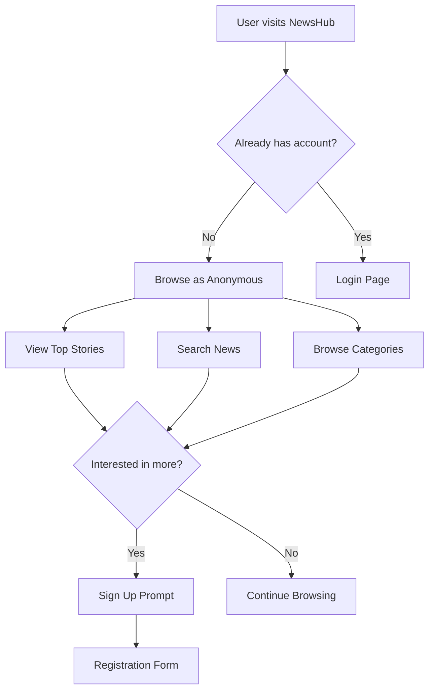
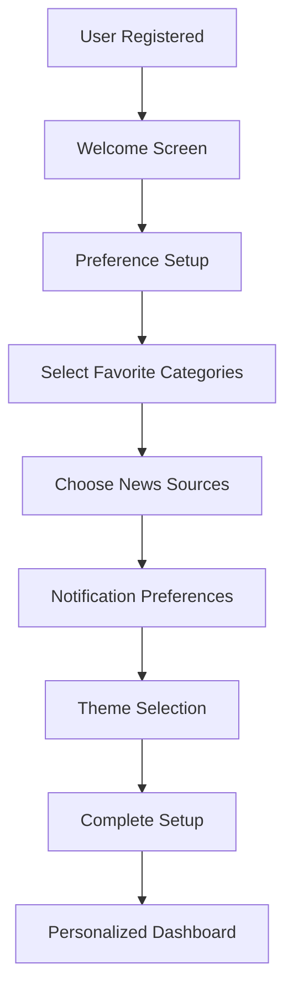

# NewsHub - User Journey & Authentication Flow

## 🎯 User Personas

### 1. **Anonymous Visitor**
- First-time visitor exploring news
- Wants to browse without commitment
- May convert to registered user

### 2. **Casual Reader**
- Registered user who reads occasionally
- Wants personalized news feed
- Uses bookmarking features

### 3. **Power User**
- Daily active user
- Customizes preferences extensively
- Engages with social features

### 4. **Administrator**
- Manages news sources and content
- Monitors system health
- Moderates user activities

---

## 🗺️ Complete User Journey

### **Phase 1: Discovery & First Visit**



### **Phase 2: Authentication Flow**

#### **2.1 Registration Journey**
```
1. User clicks "Sign Up"
2. Registration form appears with fields:
   - Email (required, validated)
   - Username (required, unique)
   - First Name (required)
   - Last Name (required)
   - Password (required, min 6 chars)
3. Form validation (real-time)
4. Submit registration
5. Account created → Auto-login
6. Welcome onboarding flow
7. Redirect to personalized dashboard
```

#### **2.2 Login Journey**
```
1. User clicks "Login"
2. Login form appears:
   - Email/Username
   - Password
   - "Remember Me" option
   - "Forgot Password" link
3. Form validation
4. Authentication
5. JWT token stored
6. Redirect to dashboard/previous page
```

#### **2.3 Password Recovery**
```
1. Click "Forgot Password"
2. Enter email address
3. Receive reset email
4. Click reset link
5. Enter new password
6. Password updated
7. Auto-login with new password
```

### **Phase 3: Onboarding (New Users)**



**Onboarding Steps:**
1. **Welcome Message**: Brief app introduction
2. **Category Selection**: Choose 3-5 preferred news categories
3. **Source Selection**: Pick trusted news sources
4. **Notification Setup**: Email digest preferences
5. **Theme Choice**: Light/Dark/Auto mode
6. **Tour**: Quick feature walkthrough

### **Phase 4: Daily Usage Flow**

#### **4.1 Authenticated User Dashboard**
```
1. Login → Dashboard
2. Personalized news feed based on:
   - Selected categories
   - Preferred sources
   - Reading history
   - Bookmarked articles
3. Quick actions available:
   - Search
   - Browse categories
   - View bookmarks
   - Account settings
```

#### **4.2 Reading & Interaction Flow**
```
1. Browse news feed
2. Click article → Full view
3. Engagement tracking:
   - View time
   - Scroll depth
   - Click tracking
4. Actions available:
   - Bookmark article
   - Share article
   - Like/React
   - Comment (future feature)
5. Related articles suggested
6. Return to feed
```

#### **4.3 Personalization Flow**
```
1. Access Settings
2. Update preferences:
   - Categories
   - Sources
   - Notifications
   - Theme
   - Language
3. View reading statistics
4. Manage bookmarks
5. Account settings
```

### **Phase 5: Advanced Features**

#### **5.1 Search & Discovery**
```
1. Enter search query
2. Real-time suggestions
3. Filter options:
   - Date range
   - Categories
   - Sources
   - Language
4. Search results with relevance
5. Save search queries
6. Search history
```

#### **5.2 Social Features**
```
1. Share articles on social media
2. View trending topics
3. See popular articles
4. Community engagement metrics
5. Follow topics/sources
```

---

## 🔐 Authentication States

### **State Management**
```typescript
interface AuthState {
  isAuthenticated: boolean;
  user: User | null;
  token: string | null;
  loading: boolean;
  error: string | null;
}
```

### **User Permissions**
- **Anonymous**: Read-only access
- **Authenticated**: Full features
- **Admin**: Management capabilities

---

## 📱 Responsive Design Considerations

### **Mobile-First Journey**
1. **Touch-Optimized**: Large buttons, swipe gestures
2. **Progressive Web App**: Offline reading, push notifications
3. **Quick Actions**: Swipe to bookmark, pull to refresh
4. **Simplified Navigation**: Bottom tab bar

### **Desktop Enhancements**
1. **Sidebar Navigation**: Persistent category menu
2. **Multi-column Layout**: Better content organization
3. **Keyboard Shortcuts**: Power user features
4. **Advanced Filtering**: More sophisticated search options

---

## 🎨 UI/UX Principles

### **Design System**
- **Clean & Modern**: Minimal, content-focused design
- **Consistent**: Uniform components and interactions
- **Accessible**: WCAG 2.1 AA compliance
- **Fast**: Optimized loading and transitions

### **Key UI Components**
1. **Navigation Bar**: Logo, search, user menu
2. **News Cards**: Title, excerpt, source, timestamp
3. **Category Tabs**: Horizontal scrollable categories
4. **User Profile**: Avatar, settings, logout
5. **Search Interface**: Autocomplete, filters
6. **Authentication Forms**: Login, register, reset

---

## 📊 Success Metrics

### **User Engagement**
- **Registration Rate**: 15% of visitors
- **Daily Active Users**: 60% retention
- **Session Duration**: Average 8+ minutes
- **Article Engagement**: 3+ articles per session

### **Feature Adoption**
- **Personalization**: 80% complete onboarding
- **Bookmarks**: 40% use bookmarking
- **Search**: 25% perform searches
- **Social Sharing**: 10% share articles

---

## 🔄 Error Handling & Edge Cases

### **Authentication Errors**
- Invalid credentials → Clear error message
- Network issues → Retry mechanism
- Token expiry → Auto-refresh or re-login
- Account locked → Contact support flow

### **Content Errors**
- No articles found → Empty state with suggestions
- Load failures → Retry button
- Slow connections → Loading states
- Offline mode → Cached content

---

## 🚀 Future Enhancements

### **Phase 2 Features**
1. **AI Recommendations**: ML-powered article suggestions
2. **Social Features**: User comments and discussions
3. **Newsletter**: Automated email digests
4. **Mobile App**: Native iOS/Android apps
5. **Premium Tier**: Ad-free, exclusive content

### **Advanced Personalization**
1. **Reading Patterns**: Time-based preferences
2. **Sentiment Analysis**: Mood-based recommendations
3. **Social Integration**: Import from social media
4. **Cross-device Sync**: Seamless experience across devices

---

This user journey provides a comprehensive roadmap for building an engaging, user-friendly news aggregation platform that grows with user needs and expectations.
